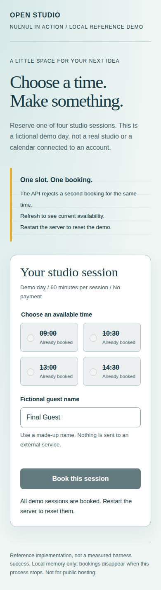

# Book a studio session

[English](README.md) | [한국어](README.ko.md) | [All cases](../README.md)

**Status: local HTTP check and 9 Chromium checks passed on 2026-09-09.** This remains a reference implementation for a future NULNUL trial, not evidence that a measured harness run generated the application. It was added after the frozen 3.1.0 release. Elapsed time, tokens, monetary cost, and comparative advantage are `unknown`. See the [source-bound validation record](../validation-2026-09-09.json).

## Request and visible result

> Build a local studio-booking screen and API. Show available times, accept a fictional guest name, and prevent two reservations for the same time. No accounts, payments, installations, or external services.

[app.py](app.py) contains the browser screen, JSON API, in-memory SQLite storage, and one bounded HTTP check. Python 3.9+ is the only runtime dependency; there are no downloaded fonts or browser assets. The interface is English.



## Run

From the repository root:

```bash
python3 examples/booking-service/app.py
```

Open `http://127.0.0.1:8765`. Use a fictional name and select a time. Refresh after booking to see the changed availability. Use `--port 8766` if the default port is occupied. Stop with Ctrl+C; all bookings are discarded.

## Completion command

```bash
python3 examples/booking-service/app.py --check
```

The check starts its own short-lived loopback server on an available port. Its assertions cover the HTML response, four available slots, a successful reservation, a `409` duplicate rejection, malformed JSON, wrong field names and types, invalid slots and names, unsupported content type, untrusted origins and hosts, and unchanged availability after rejected writes. It does not launch a browser. Do not run it with Python's `-O` flag, which disables assertions.

The same HTTP self-check is included in the repository's ordinary CI unittest suite. Run its focused regression test without calling Claude or another model:

```bash
python3 -m unittest discover -s tests -p 'test_booking_service_example.py' -v
```

Browser acceptance was checked separately in Chromium 147.0.7727.101: a reservation and reload, stale-tab duplicate rejection, a 390-pixel viewport without horizontal overflow, keyboard selection and submission, reduced motion, markup-like names rendered as text, and the fully booked state. No JavaScript runtime errors were observed. This is bounded browser coverage, not an exhaustive accessibility or cross-browser audit. The browser requested `/favicon.ico`, which returned `404`; that nonblocking omission remains unfixed.

## API contract

| Request | Expected response |
| --- | --- |
| `GET /api/slots` | `200`, `slots` with `time` and `available` |
| `POST /api/bookings` with `{"slot":"09:00","name":"Example Guest"}` | `201`, `booking` with `slot` and `name` |
| Repeat that time | `409`; the original booking remains |
| Use `guest` instead of the required `name` field | `400`; no booking is created |

POST requires `application/json`, a bounded body with `Content-Length`, and the same origin if an Origin header is present. The UI consumes the actual response fields, rather than maintaining a separate fake booking list.

## Capability decision

This reference was authored directly using Python's standard library and native browser features. No new agent, skill, plugin, MCP server, or external integration was installed. A future harness trial should first inspect its starting project and installed roster, reuse competitive capabilities, and add a bounded role only for a concrete outcome or verification gap. That trial's selection decisions have not been observed yet.

The wrong-field and duplicate-booking cases provide a concrete producer/consumer boundary and a negative control. Passing this application's check would establish only its checked behavior, not a NULNUL quality advantage.

## Limits and next evidence

This is one fictional day, with process-local storage, one synchronous request handler, and no authentication, calendar integration, cancellation, payment, or production deployment. It is intentionally bound to loopback. Do not submit real personal information or expose it through a proxy.

For a measured comparison, start each arm from the same task specification and agreed starting files, not from this completed answer. Follow the [casebook comparison rules](../README.md#a-comparison-not-a-victory-claim), record failures and setup costs, and attach independently checked results before changing the evidence status.
